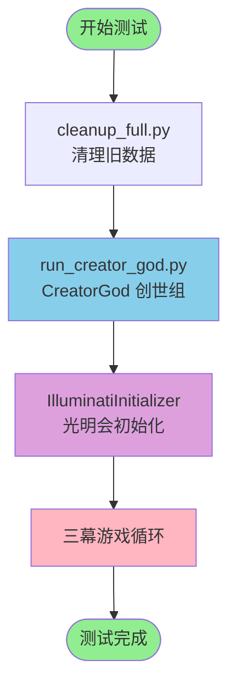
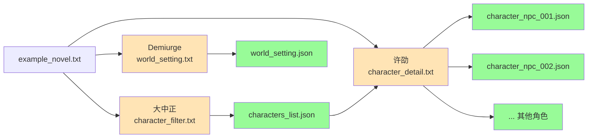
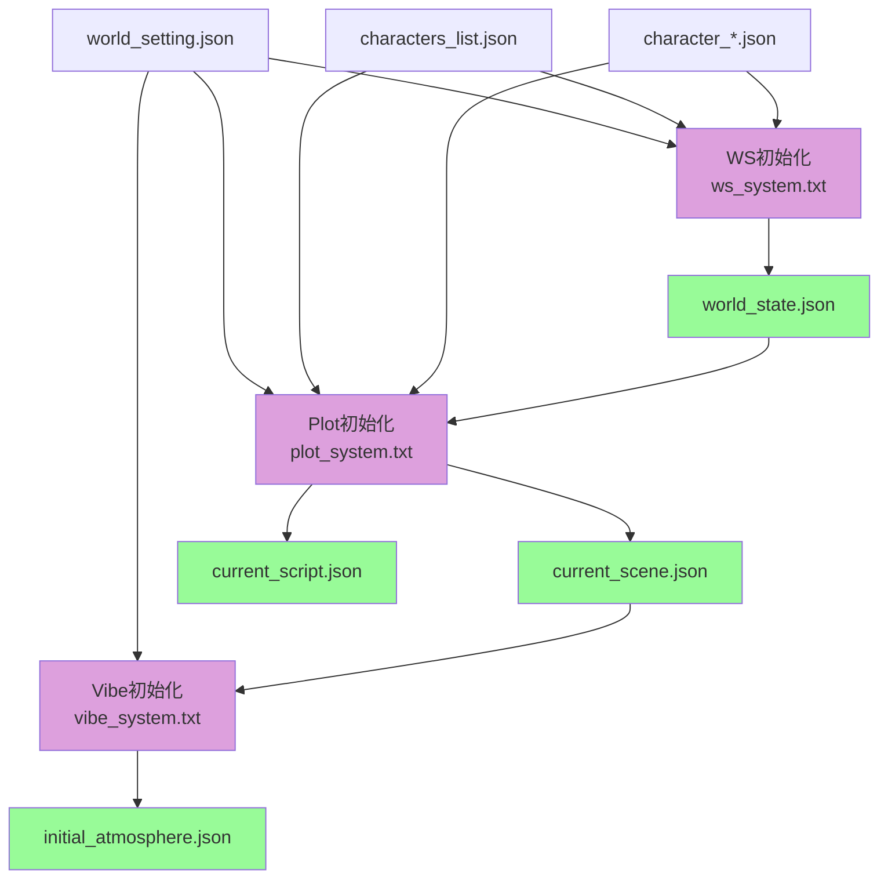
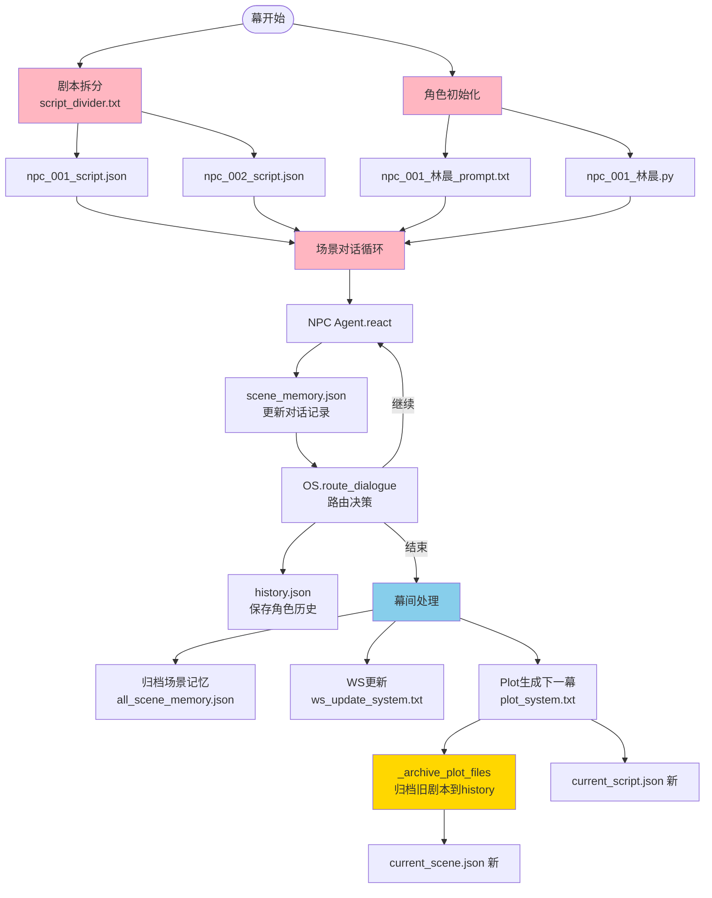
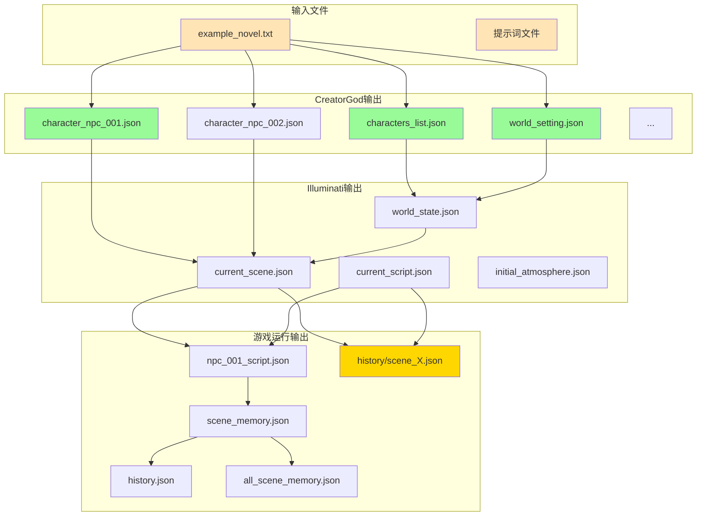
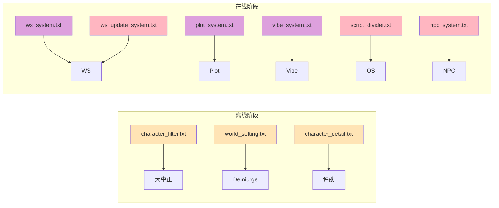
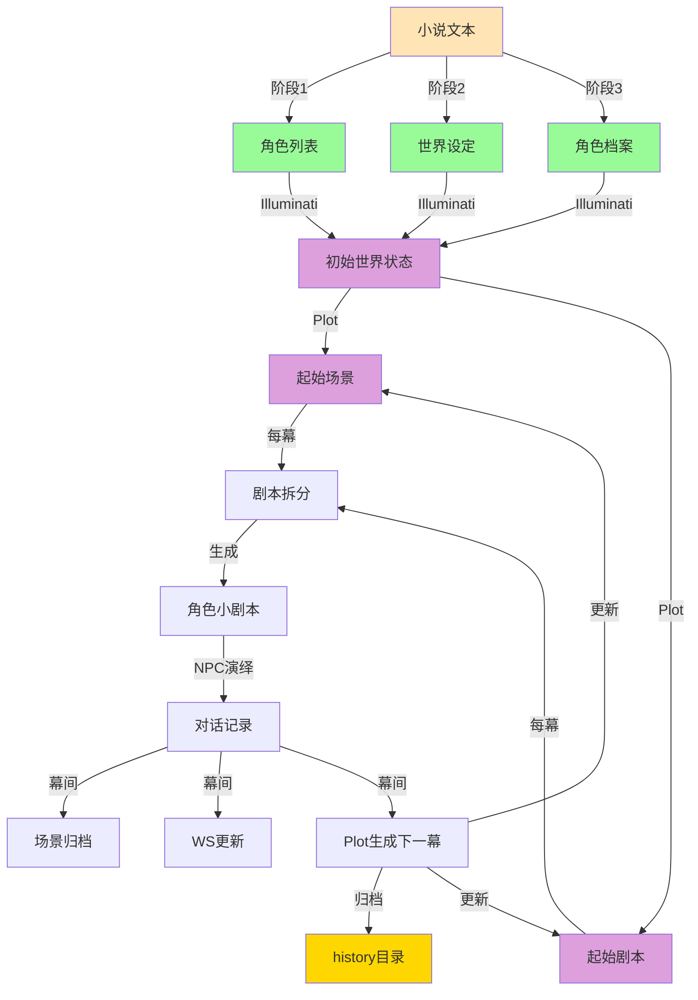

# 测试流程 Mermaid 流程图

## 完整流程概览

## CreatorGod 详细流程

## Illuminati 初始化流程

## 单幕游戏循环流程

## 文件依赖关系图

## 提示词调用链

## 数据流向图

---

**说明**: 
- 🟢 绿色：生成的数据文件
- 🟡 黄色：提示词文件
- 🟣 紫色：Illuminati阶段
- 🔵 蓝色：游戏运行阶段
- 🟠 橙色：输入文件
- 🟨 金色：归档文件（新增功能）

